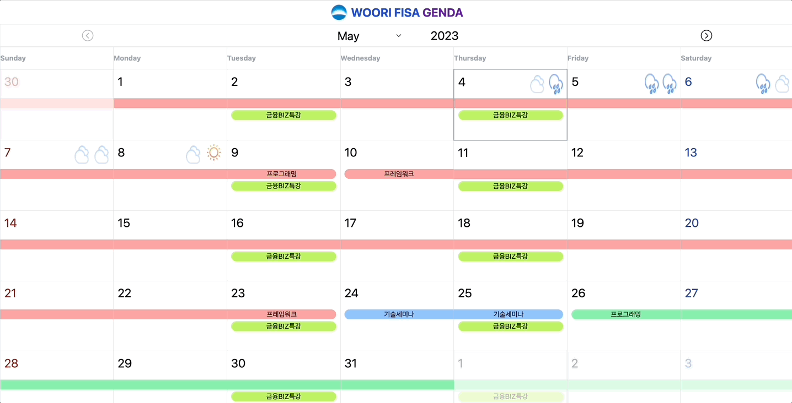

# 2th-FISAgenda

|김민준|정민성|한윤서|공태식|
|:--|:--|:--|:--|
|||||

## 프로젝트

### 주제

우리 FISA 커리큘럼을 달력에 한눈에 보여주기 위한 프로젝트

09:00 / 18:00 기준의 날씨도 함께 보여줌으로써 상쾌한 출퇴근 가능.

### 기술 스택

## 회고
### 김민준

#### 트러블 슈팅

Table의 tr 높이가 같게 조절이 되지 않는 문제
- flex 설정 -> x
- 퍼센트로 높이 조절 -> x
- height를 auto로 설정 -> 해결

 달력을 기존에 하드코딩으로 작성
 - javascript를 이용하여 각 달의 시작일 / 마지막일 기준 달력 생성

 CORS 문제
 - express의 cors 설정을 이용하여 front / back 서버가 달라도 API 호출 허용

#### 회고

Keep
- 라벨 2개 이상 정상 출력
- 오늘 날짜 표시
- 날씨 정보 출력
- tailwind css 사용

Problem
- 공휴일 정보를 불러와서 달력에 출력되면 좋겠음
- 아젠다 수정 / 삭제 / 추가 기능이 없음
- 라벨에 대한 추가 정보 필요
- JSDoc 적용 못함
- Dark Mode 적용 못함

Try
- 공휴일 API를 이용하여 대한민국 공휴일 표시
- Backend 구성하여 CRUD 기능 추가
- 라벨별로 카테고리를 추가하여 더 세세하게 분류
- 배포 후 유지보수
- JSDoc을 이용하여 문서화
- Dark Mode 적용

### 정민성

#### 트러블 슈팅#### 트러블 슈팅
#### 회고
#### 회고

### 한윤서

#### 트러블 슈팅
#### 회고

### 공태식

#### 트러블 슈팅
#### 회고
